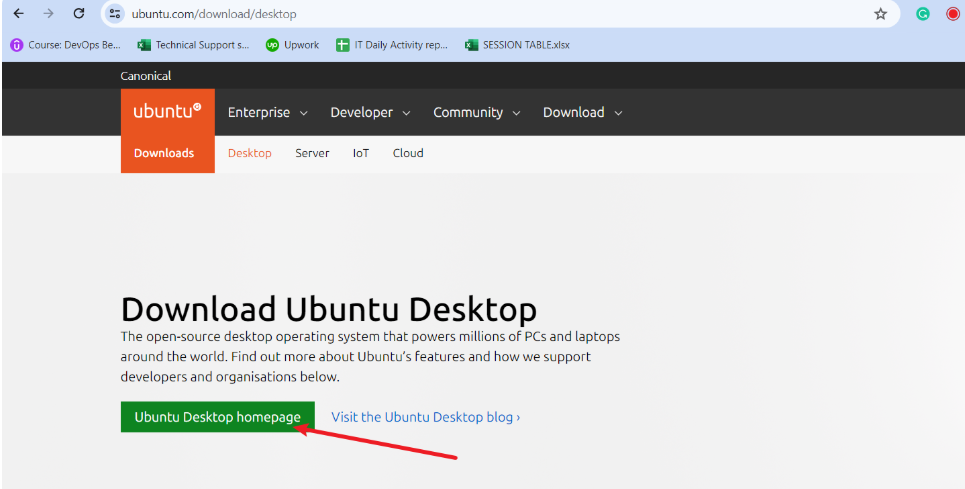

# TECH ENVIRONMENT SETUP
## Introduction
*Setting up a robust tech environment is a foundational step for any successful project or organization. Whether you're a developer, designer, or IT professional, having the right tools and configurations can significantly boost
productivity and streamline workflows. This guide will walk you through the essential steps to establish a versatile and efficient tech environment, ensuring you have everything you need to hit the ground running.*

## Tools to be installed
1. VScode
2. Git
3. Virtual Box
4. Ubuntu on Vitual box (windows/MAC)

## Accounts to be created
1.Github account
2. Amazon web services (AWS) account

## Installation of the tools

#### Visual Studio Code (VScode)
*Visual Studio Code (VSCode) is a free, open-source code editor developed by Microsoft. Known for its speed, flexibility, and extensive customization options, VSCode has become a popular choice among developers worldwide. It supports a wide range of programming languages and is equipped with features such as syntax highlighting, intelligent code completion, integrated version control, debugging tools, and extensions. The vibrant VSCode marketplace offers a vast array of plugins and themes, allowing users to tailor the editor to their specific needs and preferences. Whether you're working on web development, data science, or any other coding project, VSCode provides a powerful, user-friendly environment to boost productivity and streamline your workflow.*

#### 1.Windows installation
Download vscode **********(add a link)

 * On the webpage click download for windows if you are using a windows system.
 * **Run installer** : Locate the downloaded .exe file and double click to run the installer.
 * **Wizard** : Click next through the installation wizard.
 * **Install** : Click install and FINISH to complete the installation.

* **Launch Vscode** : Type vscode on windows app search and open.

#### macOS Vscode installation
Installing Visual Studio Code (VSCode) on macOS is a straightforward process. Here are the steps to get you started:

* **Download VSCode**: Visit the official Visual Studio Code website and download the macOS version.

* **Open the Installer**: Once the download is complete, open the installer package.

* **Drag and Drop**: Drag the VSCode icon to the Applications folder. This will make it available in the macOS Launchpad1.

* **Launch VSCode**: You can open VSCode from the Applications folder or the Launchpad.

* **Add to Dock**: For quick access, you can add VSCode to your Dock by right-clicking the icon and selecting "Options" > "Keep in Dock".

* **Open from Terminal**: To open VSCode from the terminal, you can use the code command. Add it to your PATH by opening the Command Palette (Cmd + Shift + P), typing "Shell Command: Install 'code' command in PATH," and following the prompts.

#### GIT

*Git is a distributed version control system designed to handle everything from small to very large projects with speed and efficiency. Created by Linus Torvalds in 2005, Git allows multiple developers to work on a project simultaneously without overwriting each other's changes*

#### Git installation for windows:

* **Download Git**: Visit the official Git website and download the Git installer for Windows.

* **Run the Installer**: Once the download is complete, open the installer.

* **Follow the Setup Wizard**: The Git Setup Wizard will guide you through the installation process. You can choose the default options for most users.

* **Select Components**: During the installation, you'll be asked to select components to install. Make sure to select "Git Bash Here" and "Windows Explorer Integration" for easier access to Git commands3.

* **Complete the Installation**: Follow the remaining prompts to complete the installation.

* **Verify Installation**: Open the Git Bash or Command Prompt and type git version to verify that Git has been installed successfully.

#### Git installation on homebrew on macOS

* **Open Terminal**: Launch the Terminal application on your Mac.

  Install Homebrew: If you don't already have Homebrew installed, you can install it by running the following command:

/bin/bash -c "$(curl -fsSL https://raw.githubusercontent.com/Homebrew/install/HEAD/install.sh)"

* **Install Git**: Once Homebrew is installed, you can install Git by running: `brew install git`
* **Verify Installation**: To check if Git was installed successfully, run:
`git --version` 
This command should display the installed version of Git.

### Vitual Box

*VirtualBox is an open-source virtualization software developed by Oracle. It allows users to run multiple operating systems on a single physical machine by creating virtual machines (VMs)2. This is particularly useful for testing different OS configurations, running legacy applications, or developing software for multiple platforms on one machine1.
VirtualBox supports a wide range of operating systems, including Windows, Linux, macOS, and Solaris. It's available for personal and enterprise use, with a free license for personal use and a commercial license for business use.*

#### Windows Installation

* **Download VirtualBox**:
Go to the official VirtualBox website.
Click on "Download VirtualBox" and select "Windows hosts" to download the installer for Windows.

* **Run the Installer**:
Once the download is complete, open the installer file to start the installation process.

* **Follow the Setup Wizard**:
The VirtualBox Setup Wizard will guide you through the installation. You can typically use the default settings unless you have specific preferences.

* **Select Installation Options**:
During the installation, you can choose to create shortcuts and register file associations. You can leave these options checked or uncheck them based on your preferences.

* **Proceed with Installation**: Click "Next" and then "Install" to begin the installation. You might see a warning about network interfaces being reset temporarily—this is normal.

* **Complete the Installation**: After the installation is complete, click "Finish" to exit the Setup Wizard.

* **Launch VirtualBox**: You can now open VirtualBox from your Start menu or desktop shortcut.

#### MacOS Installation

* **Download VirtualBox**:
Visit the official VirtualBox website.
Click on "Download VirtualBox" and select "OS X hosts" to download the macOS version.

* **Open the Installer**:
Once the download is complete, open the .dmg installer file.

* **Run the Installer**:
In the opened window, double-click the "VirtualBox.pkg" icon to start the installation process.

* **Follow the Setup Wizard**:
The VirtualBox Installation Wizard will guide you through the installation. Click "Continue" and follow the on-screen instructions.

* **Allow System Extensions**:
During the installation, you might see a security prompt asking you to allow system extensions. Click "Open Security Preferences" and then "Allow" to proceed with the installation.

* **Complete the Installation**:
Once the installation is complete, you can close the installer.

* **Launch VirtualBox**:
You can now open VirtualBox from your Applications folder or the Launchpad.

### Ubuntu (Linux distro) on VitualBox (Windows)

* **Download Ubuntu**: Visit the official Ubuntu website and download the latest version of Ubuntu. You'll get an ISO file1.

* **Create a New Virtual Machine**: Open VirtualBox and click on "New" to create a new virtual machine. Give it a name (e.g., "Ubuntu") and select "Linux" as the type and "Ubuntu" as the version.

* **Allocate Memory (RAM)**: Assign the amount of RAM you want to allocate to the virtual machine. A good starting point is 2GB, but you can adjust based on your system's resources.

* **Create a Virtual Hard Disk**: Click on "Create" and then "Next" to create a virtual hard disk. Choose "VDI (VirtualBox Disk Image)" as the file type and click "Next."

* **Specify Disk Size**: Decide on the size of the virtual hard disk. A minimum of 20GB is recommended for Ubuntu, but you can allocate more if you plan to install additional software.

* **Finish the Virtual Machine Wizard**: Click "Create" to finish the wizard and return to the main VirtualBox window.

* **Configure the Virtual Machine**: Select the newly created virtual machine and click on "Settings." Go to the "System" tab and ensure that the "Enable I/O APIC" option is checked. Also, go to the "Storage" tab, click on the "Empty" slot under "Controller: IDE," and then click on the disk icon to add the Ubuntu ISO file you downloaded earlier2.

* **Start the Virtual Machine**: Click "Start" to boot up the virtual machine. You should see the Ubuntu installation screen2.

* **Install Ubuntu**: Follow the on-screen instructions to install Ubuntu. When prompted, choose "Erase disk and install Ubuntu" to set up the virtual machine3.

* **Complete the Installation**: Once the installation is complete, reboot the virtual machine, and you should be greeted with the Ubuntu login screen

  
### Ubuntu (Linux distro) on VitualBox (MAC Host)

* **Download Ubuntu**: Go to the official Ubuntu website and download the ISO file for the latest version of Ubuntu.

* **Create a New Virtual Machine**: Open VirtualBox and click on the "New" button.
Name your VM (e.g., "Ubuntu") and set the type to "Linux" and version to "Ubuntu (64-bit)".

* **Allocate Memory (RAM)**:
Allocate at least 2 GB of RAM (2048 MB), although 4 GB or more is recommended for better performance.

* **Create a Virtual Hard Disk**:
Choose "Create a virtual hard disk now" and click "Create".
Select "VDI (VirtualBox Disk Image)" and click "Next".
Choose "Dynamically allocated" and click "Next".
Set the disk size (at least 20 GB is recommended) and click "Create".

* **Configure the Virtual Machine**:
Select your newly created VM and click on "Settings".
Go to the "Storage" tab, click on the "Empty" slot under "Controller: IDE", and then click on the disk icon on the right to add the Ubuntu ISO file you downloaded earlier.

* **Start the Virtual Machine**:
Click on "Start" to boot up your virtual machine.You should see the Ubuntu installation screen.

* **Install Ubuntu**:
Follow the on-screen instructions to install Ubuntu. When prompted, choose "Erase disk and install Ubuntu" (this will only affect the virtual disk, not your macOS system).
Complete the installation process and restart the virtual machine when prompted.

* **Remove the Installation Media**:
Name your VM (e.g., "Ubuntu") and set the type to "Linux" and version to "Ubuntu (64-bit)".Name your VM (e.g., "Ubuntu") and set the type to "Linux" and version to "Ubuntu (64-bit)".After the VM restarts, go to "Devices" > "Optical Drives" > "Remove disk from virtual drive" to eject the ISO file from the virtual drive.

## Creating GITHUB and AWS accounts
### Creating a GitHub Account:

* **Go to GitHub**: Visit github.com and click on "Sign up."

* **Enter Your Details**: Provide your email, password, and username. You can also choose whether to receive emails from GitHub1.

* **Verify Your Email**: Check your inbox for a verification email from GitHub and click on the link to verify your account.

* **Complete Setup**: Follow the prompts to complete your profile setup. You can now start exploring GitHub and creating repositories.

### Creating an AWS Account:

* **Visit AWS**: Go to the AWS website and click on "Create an AWS Account."

* **Enter Account Information**: Provide your email, password, and account name.

* **Verify Your Email**: Check your inbox for a verification email from AWS and click on the link to verify your account.

* **Add Contact Information**: Enter your contact details and choose an account type (Personal or Business).

* **Add a Payment Method**: Enter your credit card information for billing purposes.

* **Verify Your Phone Number**: Enter your phone number and verify it with an OTP (one-time password).

* **Choose a Support Plan**: Select a support plan that fits your needs.

* **Complete Sign-Up**: Follow the remaining prompts to complete the sign-up process

